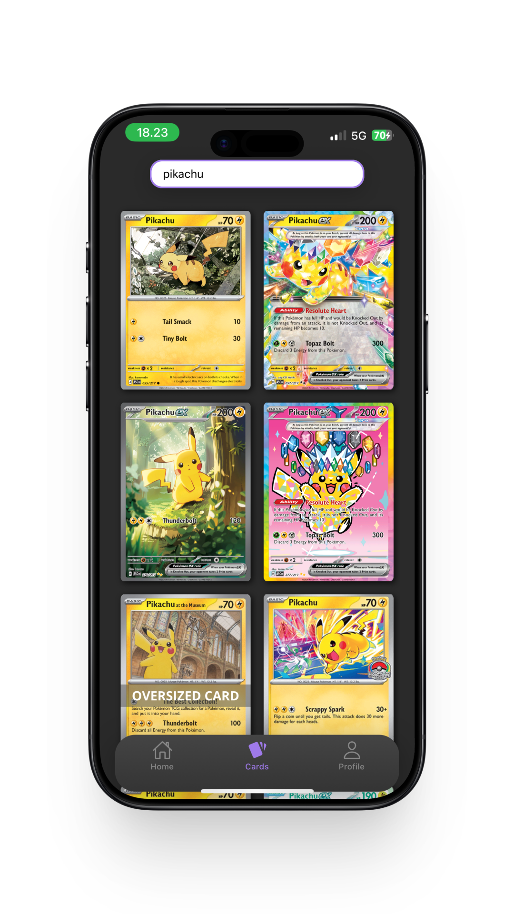

# Pokémon Card Tracker

A simple Pokémon card tracker that pulls live pricing from Cardmarket
 
## Tech Stack

* **Frontend:** React Native
* **Backend:** C#
* **Auth & DB:** Firebase
* **Data:** Cardmarket API

## Planned Features

- [ ] Database storage for user collections
- [ ] Portfolio value tracking and historical charts
- [ ] Light mode theme options